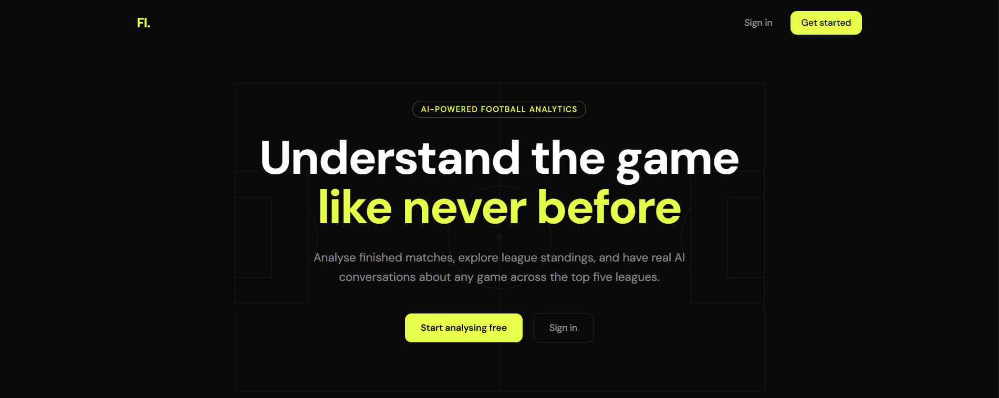

# Football Analytics ⚽

An AI-powered football intelligence platform that lets you explore match statistics, league standings, team information, and have real AI conversations about any finished match across the top five European leagues and the Champions League.

**[Live Demo](https://your-url.vercel.app)** · **[GitHub](https://github.com/NifemiSoneye/football-intelligence-app)**



---

## Features

- **League Pages** — Standings, results, and fixtures for the Premier League, La Liga, Bundesliga, Serie A, Ligue 1, Champions League, and FIFA World Cup. Season toggle to switch between current and previous season.
- **Team Pages** — Squad overview, coach info, active competitions, and match history.
- **Match Pages** — Four tabs per finished match:
  - **Overview** — Full match events timeline (goals, cards, substitutions)
  - **Stats** — 27 curated statistics with period toggle (All / 1st Half / 2nd Half) and comparison bars
  - **Lineups** — Starting XI and substitutes with real kit colors from Sofascore
  - **AI Analysis** — Persistent AI chat powered by Claude, with a 10-message session limit and save functionality
- **Saved Analyses** — Save and revisit AI match conversations
- **Authentication** — Secure sign up / sign in via Kinde
- **Personalisation** — Choose favourite leagues and teams on onboarding

---

## Tech Stack

| Category | Technology |
|---|---|
| Framework | Next.js 15 (App Router) |
| Language | TypeScript |
| Styling | Tailwind CSS + Shadcn UI |
| Database | Neon PostgreSQL |
| ORM | Drizzle ORM |
| Auth | Kinde |
| AI | Anthropic Claude API (claude-sonnet-4-6) |
| Match Data | football-data.org |
| Rich Stats | Sofascore via RapidAPI |
| Deployment | Vercel |

---

## Architecture

### Multi-API Bridge
The app combines two football APIs — **football-data.org** for match metadata and **Sofascore** (via RapidAPI) for rich statistics, lineups, and incidents. Since the two APIs use different team name conventions, a normalisation layer bridges them:

1. Match ID and team names are fetched from football-data.org
2. The normaliser strips club suffixes (FC, AFC, CF, SC etc.), replaces accented characters, and maps known name discrepancies (e.g. `Club Atlético de Madrid` → `Atletico Madrid`)
3. Sofascore's tournament history is paginated to find the matching match ID
4. Statistics, lineups, and incidents are fetched in parallel and cached per match

### AI Integration
Each finished match generates a **match snapshot** (~600 tokens) containing the score, goals, 27 key statistics, and both starting XIs. This snapshot is injected into Claude's system prompt on every message, giving the model full match context without re-fetching data. Sessions are persisted per user per match in PostgreSQL.

- Model: `claude-sonnet-4-6`
- Max messages per session: 10 (5 exchanges)
- Context window: last 6 messages
- Estimated cost: ~$0.04–0.05 per full session

### Caching Strategy
All football data is cached using Next.js `unstable_cache` with revalidation windows tuned per data type:
- Match data: 24 hours
- Standings: 1 hour
- Fixtures: 1 hour
- Results: 30 minutes
- Sofascore match data: 24 hours

---

## Getting Started

### Prerequisites
- Node.js 18+
- A Neon PostgreSQL database
- Kinde account (auth)
- football-data.org API key (free tier)
- RapidAPI key with Sofascore subscription
- Anthropic API key

### Installation

```bash
git clone https://github.com/NifemiSoneye/football-intelligence-app
cd football-intelligence-app
npm install
```

### Environment Variables

Create a `.env.local` file in the root:

```env
# Kinde Auth
KINDE_CLIENT_ID=
KINDE_CLIENT_SECRET=
KINDE_ISSUER_URL=
KINDE_SITE_URL=
KINDE_POST_LOGOUT_REDIRECT_URL=
KINDE_POST_LOGIN_REDIRECT_URL=

# Database
DATABASE_URL=

# Football APIs
FOOTBALL_DATA_API_KEY=
RAPIDAPI_KEY=

# Anthropic
ANTHROPIC_API_KEY=
```

### Database Setup

```bash
npx drizzle-kit push
```

### Run Locally

```bash
npm run dev
```

Open [http://localhost:3000](http://localhost:3000)

---

## Project Structure

```
src/
├── app/
│   ├── dashboard/
│   │   ├── league/[leagueId]/
│   │   │   └── matches/[matchId]/   # Match page + AI chat
│   │   ├── team/[teamId]/           # Team page
│   │   ├── saved-analyses/          # Saved AI analyses
│   │   └── settings/                # User preferences
│   └── onboarding/                  # League + team picker
├── actions/                         # Server actions (chat, save)
├── components/                      # Shared UI components
├── db/                              # Drizzle schema + client
├── lib/
│   ├── claude.ts                    # AI integration
│   ├── football-data.ts             # football-data.org API
│   ├── sofascore.ts                 # Sofascore API + bridge
│   ├── cached-football-data.ts      # Cached wrappers
│   └── match-snapshot.ts            # AI context builder
└── types/                           # TypeScript types
```

---

## Roadmap

- [ ] Jest/RTL tests for `normalizeTeamName`, `buildMatchSnapshot`, `sendMessage`
- [ ] TypeScript strict mode
- [ ] Additional league support
- [ ] Player search

---

## Author

**Nifemi Soneye** — [@AFCNIFEMI](https://twitter.com/AFCNIFEMI) · [LinkedIn](https://linkedin.com/in/nifemi-soneye) · [Portfolio](https://nifemisoneye-portfolio.vercel.app)
